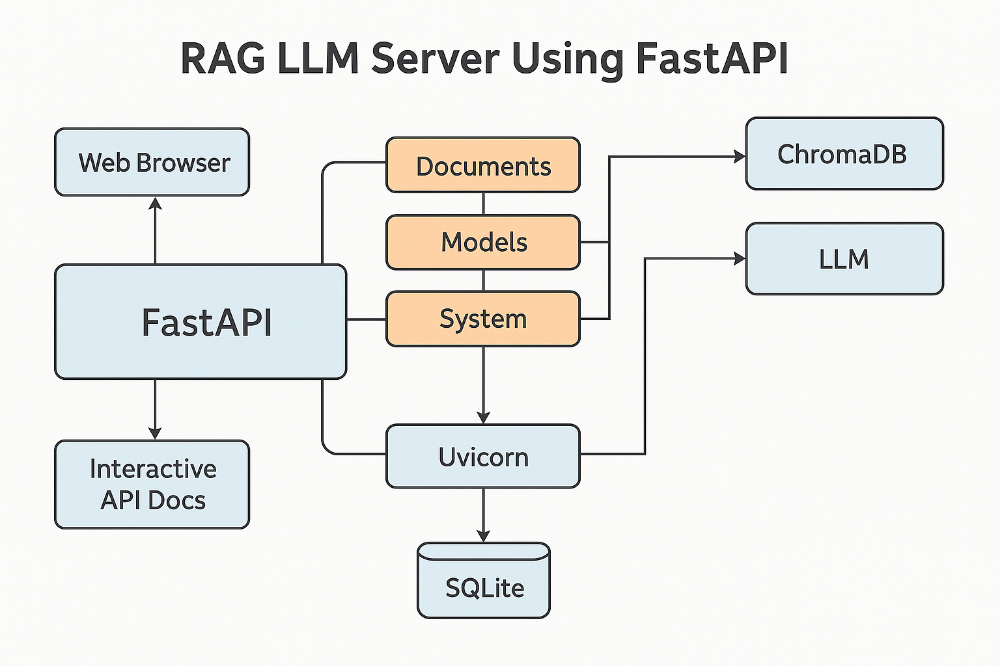

# The Most Logical Starting Point: The Basic Server Structure #

Before we can handle documents, models, or chats, we need the fundamental web server framework in place. This will be the skeleton upon which we'll hang all the other features. We'll use **FastAPI** for this, as it's modern, fast, asynchronous (great for I/O-bound tasks like network requests and potentially waiting for LLMs), and has excellent built-in documentation features.
  
[Reasoning behind the code](reasoning/r1.md)  
  
**Step 1: Project Setup and Basic FastAPI App**

1.  **Create Project Directory:**
    ```bash
    mkdir rag_llm_server
    cd rag_llm_server
    ```

2.  **Set up a Virtual Environment (Recommended):**
    ```bash
    python -m venv venv
    # Activate it:
    # Windows:
    # venv\Scripts\activate
    # macOS/Linux:
    # source venv/bin/activate
    ```

3.  **Install Initial Dependencies:**
    ```bash
    pip install fastapi uvicorn[standard]
    ```
    *   `fastapi`: The web framework.
    *   `uvicorn`: An ASGI server to run our FastAPI application. `[standard]` includes useful extras like websocket support (which we might use later) and better performance.

4.  **Create the Main Application File (`main.py`):**

    ```python
    # main.py
    import uvicorn
    from fastapi import FastAPI
    import datetime
    import os

    # --- Core Application Setup ---
    # Create the main FastAPI application instance
    app = FastAPI(
        title="RAG LLM Server",
        description="API server for managing RAG documents, interacting with LLMs, and managing chat sessions.",
        version="0.1.0",
    )

    # --- Basic Root Endpoint ---
    @app.get("/")
    async def read_root():
        """
        Root endpoint providing basic server information.
        """
        return {
            "message": "Welcome to the RAG LLM Server!",
            "status": "running",
            "timestamp": datetime.datetime.now(datetime.timezone.utc).isoformat()
        }

    # --- Placeholder for Future Routers ---
    # We will add routers for different functionalities (documents, models, sessions, system) later.
    # Example: from app.api.endpoints import documents
    #          app.include_router(documents.router, prefix="/api/v1/documents", tags=["Documents"])

    # --- Running the Server (for direct execution) ---
    if __name__ == "__main__":
        # Get port from environment variable or default to 8000
        port = int(os.environ.get("PORT", 8000))
        print(f"Starting server on http://localhost:{port}")
        # Uvicorn is used to run the FastAPI application
        # --reload enables auto-reloading during development when code changes
        uvicorn.run("main:app", host="0.0.0.0", port=port, reload=True)

    ```

5.  **Create a `.gitignore` file:**
    ```
    # .gitignore
    venv/
    __pycache__/
    *.pyc
    *.pyo
    .env
    *.db
    *.db-journal
    chroma_db_data/ # Placeholder for ChromaDB data directory
    local_models/ # Placeholder for local LLM model files
    uploaded_docs/ # Placeholder for temporarily stored uploads
    *.log

    # IDE specific files
    .idea/
    .vscode/
    *.swp
    ```

6.  **Run the Server:**
    ```bash
    uvicorn main:app --reload
    ```
    *   `main`: Refers to the `main.py` file.
    *   `app`: Refers to the `FastAPI` instance named `app` inside `main.py`.
    *   `--reload`: Tells uvicorn to automatically restart the server when it detects changes in the code files. Very handy for development.

7.  **Access the Server:**
    *   Open your web browser and go to `http://localhost:8000` (or `http://127.0.0.1:8000`). You should see the JSON response:
        ```json
        {
          "message": "Welcome to the RAG LLM Server!",
          "status": "running",
          "timestamp": "..."
        }
        ```
    *   Go to `http://localhost:8000/docs`. FastAPI automatically generates interactive API documentation (Swagger UI).
    *   Go to `http://localhost:8000/redoc`. FastAPI also provides alternative documentation (ReDoc).


## **Core Theory: Why Design the Server This Way?**

Let’s break down **why** this server is being designed this way—from both a **software architecture** and **pragmatic AI deployment** perspective. This architecture is shaped by **best practices** in modern backend development, **AI systems engineering**, and **developer ergonomics**.

---

### 1. **Separation of Concerns (SoC)**

> ❝ Each part of your system should have *one job*. ❞

We're starting with just a single file (`main.py`), but we’ve already planned for separate parts: documents, models, chat sessions, system health. These will later be moved into their own *routers* (i.e., modules).

Why?
- It keeps your code **modular** and easier to maintain.
- You can work on documents logic without breaking the models logic.
- You can test each piece independently.

This mirrors *microservice thinking*, even within a monolithic FastAPI app.

---

### 2. **FastAPI + ASGI = Async First Design**

> ❝ Async means you’re ready for real-world, I/O-heavy tasks. ❞

FastAPI is based on **ASGI**, which is great for:
- Concurrent connections (important if multiple users query the LLM at once)
- Non-blocking operations (like waiting for LLMs to respond or fetching documents from disk/cloud)

Compare this to something like Flask, which is WSGI-based and blocking—FastAPI is just more scalable **out of the box**, especially in AI applications.

---

### 3. **Developer UX and Auto-Documentation**

> ❝ If your API doesn’t document itself, your team (or future-you) will hate maintaining it. ❞

FastAPI automatically creates:
- `/docs` (Swagger UI): Interactive API testing interface
- `/redoc`: Clean alternative documentation

This makes testing and collaborating much easier:
- Frontend devs can understand what the backend provides
- PMs can test endpoints
- You can onboard new devs faster

This is *huge* in AI projects that evolve quickly and may involve multiple contributors.

---

### 4. **Deployment-Friendly from Day 1**

We already use:
```python
port = int(os.environ.get("PORT", 8000))
```
This is **12-Factor App** thinking—build apps that are *portable* and *configurable by environment*.

Why does this matter?
- You can deploy to Heroku, GCP, AWS, etc., without code changes.
- You can spin up dev, staging, and prod environments easily.
- It future-proofs your server for Docker, Kubernetes, or serverless deployment.

---

### 5. **LLM-Specific Readiness**

This isn’t just a regular API—it’s being built with **RAG (Retrieval-Augmented Generation)** and **LLM orchestration** in mind.

That means:
- It needs to be **asynchronous** (because LLM responses can be slow).
- It needs **modular architecture** for handling documents, models, and chats independently.
- It’s going to do **I/O-bound work**: loading files, querying vector DBs (like ChromaDB), streaming AI responses—so we need a design that can handle all that **concurrently**.

---

### 6. **Ease of Scaling**

Because we’re starting with:
```python
uvicorn main:app --reload
```
...we can later scale this in two main ways:
- **Horizontally**: Add more instances behind a load balancer.
- **Vertically**: Add more processing power/memory to handle larger LLM workloads.

And because FastAPI is ASGI-based, we can also plug in **websockets** or **streaming responses** later, for real-time AI conversations.

---

### 7. **Predictable and Testable Growth Path**

By building in this way, we can confidently say:
- We’ll soon add folders like `app/api/endpoints`, `app/services`, `app/models`.
- Each endpoint can get its own route, validation model, and service logic.
- We can **unit test each piece independently** (especially useful for CI/CD and automation).

---

### 8. **Low Cognitive Load to Onboard Others**

If you bring on another dev (or AI agent) to contribute, they can:
- Navigate the code quickly
- Run the server locally
- Use Swagger UI to test without needing a frontend
- Extend endpoints without unraveling the whole codebase

This is critical for RAG-based applications that often evolve quickly with AI model improvements.

---

## 🧩 Summary

| Principle | Why It Matters |
|----------|----------------|
| **Separation of Concerns** | Keeps features isolated and maintainable |
| **Async Design** | Handles slow LLM or database calls without freezing |
| **Auto-docs** | Makes collaboration and testing easy |
| **Environment Config** | Readiness for cloud and container deployment |
| **Modularity for RAG** | Supports future growth: documents, models, chat, users |
| **Scaling Readiness** | You can go from dev machine to cloud cluster easily |
| **LLM-Oriented** | Prepped for streaming, chunked uploads, vector search |
| **Team-Friendly** | FastAPI makes your backend self-explanatory to others |

---



---

1.  **Imports:** We import `FastAPI` to create our web application, `uvicorn` to run it programmatically (though we mostly use the command line), `datetime` for the timestamp, and `os` to potentially read environment variables later (like the port).
2.  **`FastAPI(...)`:** This line creates the main application object. We give it a `title`, `description`, and `version`, which are used in the automatic API documentation.
3.  **`@app.get("/")`:** This is a decorator provided by FastAPI. It tells the application that the function below (`read_root`) should handle GET requests made to the root path (`/`).
4.  **`async def read_root():`:** We define the function as `async`. FastAPI is built on ASGI (Asynchronous Server Gateway Interface), and using `async` allows FastAPI to handle requests concurrently without blocking, which is crucial for performance, especially when dealing with I/O operations like network calls, database access, or waiting for LLM responses.
5.  **Return Value:** The function returns a Python dictionary. FastAPI automatically converts this dictionary into a JSON response.
6.  **`if __name__ == "__main__":`:** This standard Python construct allows the script to be run directly. When you execute `python main.py`, this block runs. We use it here to start the `uvicorn` server programmatically, although running `uvicorn main:app --reload` from the terminal is more common during development. We added getting the port from an environment variable as good practice.
7.  **Project Structure (Initial):** Right now, it's just `main.py` and `requirements.txt`. As we add features, we'll create subdirectories (like `app`, `core`, `services`, `models`, `db`) to keep the code organized.

 
| Concept	| What It Means |
| --------| --------------| 
| FastAPI	| A Python tool to build web APIs easily and fast. | 
| Uvicorn	| A server that runs your FastAPI app and makes it available on the web. | 
| Route	| A path like / that a browser or app can request. | 
| Endpoint	| A function that handles a specific route. | 
| JSON	| A format to send and receive data between servers and browsers. | 
| async | def	Makes functions faster and able to handle many users at once. | 


**Next Steps:**

We have the basic server running. The next logical step is to set up the configuration management and initialize our database connections (SQLite for metadata/sessions and ChromaDB for vectors). This is foundational because almost all other features will depend on configuration settings and database access.
