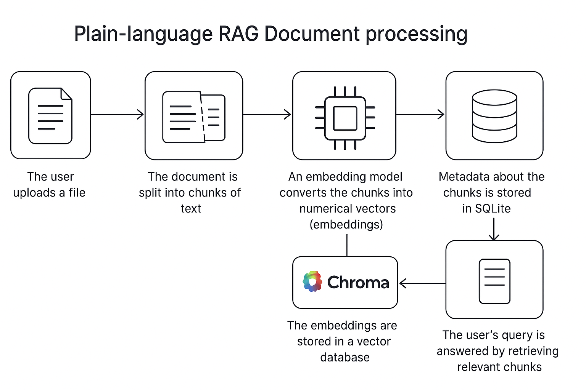

# Step 4: Vector Embedding Integration #

We're building a system that understands documents in a way that a computer can search through them intelligently (not just matching exact words). To do that, we:

1.    Break a document into pieces (chunks).
2.    Turn those pieces into numbers that represent their meaning (embeddings).
3.    Store those numbers in a database (ChromaDB).
4.    Later, we can search using natural language, and it'll find relevant document chunks using these embeddings.

Let's add vector embedding to the pipeline. We'll use the popular `sentence-transformers` library to load a model from Hugging Face and generate embeddings, then store them in ChromaDB.
   
[Reasoning behind the code](reasoning/r4.md)
   
1.  **Install Dependencies:**
    ```bash
    pip install sentence-transformers torch torchvision torchaudio
    ```
    *   `sentence-transformers`: The core library for using embedding models easily.
    *   `torch`, `torchvision`, `torchaudio`: PyTorch is required by `sentence-transformers`. Install the version appropriate for your system (CPU or CUDA-enabled GPU). The command above usually fetches a suitable version. If you have a specific CUDA setup, you might consult the [PyTorch installation guide](https://pytorch.org/get-started/locally/).

2.  **Update Configuration (`core/config.py`):**

Store important settings here, like:
- Which model to use for embeddings (`all-MiniLM-L6-v2`).
- Whether to use the CPU or GPU (`cpu` or `cuda`).
- How many text chunks to process at once (`32` is the batch size).

This helps make your app flexible and configurable from one place.

Add settings for the embedding model.

    ```python
    # core/config.py
    # ... (previous imports)

    class Settings(BaseSettings):
        # ... (previous settings)

        # --- NEW: Embedding Settings ---
        EMBEDDING_MODEL_NAME: str = Field(
            default="all-MiniLM-L6-v2", # Good default, balance of speed/performance
            description="The Hugging Face sentence-transformers model name to use for embeddings."
        )
        EMBEDDING_DEVICE: str = Field(
            default="cpu", # Default to CPU, change to "cuda" if GPU is available and configured
            description="Device to run the embedding model on ('cpu', 'cuda')."
        )
        EMBEDDING_BATCH_SIZE: int = Field(
            default=32, # Process chunks in batches for efficiency
            description="Batch size for generating embeddings."
        )

        # --- ChromaDB Settings ---
        DOCUMENT_COLLECTION_NAME: str = "rag_documents"
        SESSION_COLLECTION_NAME: str = "chat_sessions"

        # --- Document Processing Settings ---
        UPLOAD_DIR: Path = Path(tempfile.gettempdir()) / "rag_server_uploads"
        CHUNK_SIZE: int = Field(default=1000, description="Target size for text chunks (in characters)")
        CHUNK_OVERLAP: int = Field(default=150, description="Overlap between consecutive chunks (in characters)")
        SUPPORTED_FILE_TYPES: list[str] = Field(default=[...]) # Keep existing list

        # --- Pydantic settings configuration ---
        # ... (rest of the file)

    settings = Settings()

    # ... (directory creation and print statements)
    print(f"Embedding Model: {settings.EMBEDDING_MODEL_NAME} on {settings.EMBEDDING_DEVICE}")
    print(f"--------------------------")
    ```
    *   `EMBEDDING_MODEL_NAME`: Specifies the model. `all-MiniLM-L6-v2` is a good starting point.
    *   `EMBEDDING_DEVICE`: Controls whether to use CPU or GPU. Set to `"cuda"` if you have a compatible NVIDIA GPU and CUDA toolkit installed.
    *   `EMBEDDING_BATCH_SIZE`: How many chunks to process at once by the model.

3.  **Create Embedding Service (`services/embedding_service.py`):**
    This service will handle loading the model and generating embeddings.

This file does 3 things:

#### a. Load the model (just once)
```python
_embedding_model = None  # global variable
```
We load the model only once to save time.

#### b. Function to load it:
```python
def _load_embedding_model():
```
It loads the model, checks if the GPU is available (if requested), and logs the time it took.

#### c. Generate embeddings
```python
def generate_embeddings(texts: List[str]) -> List[List[float]]:
```
This function takes a list of strings and turns them into embeddings—basically, large lists of numbers that capture meaning.

Example:
```python
["The sky is blue", "Apples are red"]
# becomes something like
[[0.21, -0.13, ...], [0.33, 0.02, ...]]
```

---

    ```python
    # services/embedding_service.py
    import time
    import logging
    from typing import List, Optional
    import torch
    from sentence_transformers import SentenceTransformer
    from core.config import settings

    logging.basicConfig(level=logging.INFO)
    logger = logging.getLogger(__name__)

    # --- Global variable to hold the loaded model ---
    # Avoids reloading the model on every request/task
    _embedding_model: Optional[SentenceTransformer] = None

    def _load_embedding_model() -> SentenceTransformer:
        """Loads the Sentence Transformer model."""
        global _embedding_model
        if _embedding_model is None:
            logger.info(f"Loading embedding model '{settings.EMBEDDING_MODEL_NAME}' onto device '{settings.EMBEDDING_DEVICE}'...")
            start_time = time.time()
            try:
                # Check for CUDA availability if requested
                if settings.EMBEDDING_DEVICE == "cuda" and not torch.cuda.is_available():
                    logger.warning("CUDA requested but not available. Falling back to CPU.")
                    settings.EMBEDDING_DEVICE = "cpu"

                _embedding_model = SentenceTransformer(
                    settings.EMBEDDING_MODEL_NAME,
                    device=settings.EMBEDDING_DEVICE,
                    cache_folder=str(settings.HUGGINGFACE_HUB_CACHE.resolve()) # Use configured cache path
                )
                # You might want to warm up the model here if needed
                # _embedding_model.encode(["Warm-up sentence."])
                load_time = time.time() - start_time
                logger.info(f"Embedding model loaded successfully in {load_time:.2f} seconds.")
            except Exception as e:
                logger.error(f"Failed to load embedding model '{settings.EMBEDDING_MODEL_NAME}': {e}")
                # Depending on requirements, you might want to raise the exception
                # or handle it gracefully (e.g., disable embedding features)
                raise RuntimeError(f"Could not load embedding model: {e}") from e
        return _embedding_model

    def get_embedding_model() -> SentenceTransformer:
        """Returns the loaded embedding model, loading it if necessary."""
        # This function ensures the model is loaded only once.
        return _load_embedding_model()

    def generate_embeddings(texts: List[str]) -> Optional[List[List[float]]]:
        """Generates embeddings for a list of texts using the loaded model."""
        if not texts:
            return []
        try:
            model = get_embedding_model()
            logger.info(f"Generating embeddings for {len(texts)} text chunks...")
            start_time = time.time()
            # Use model.encode for generating embeddings.
            # `show_progress_bar=False` as logs provide feedback.
            # Set batch size from config.
            embeddings = model.encode(
                texts,
                batch_size=settings.EMBEDDING_BATCH_SIZE,
                show_progress_bar=False,
                convert_to_numpy=False # Keep as tensors for potential GPU efficiency, convert later if needed
            ) # final result is a list of lists for JSON/DB compatibility
            gen_time = time.time() - start_time
    
            # Explicit Conversion to List[List[float]]
            final_embeddings: List[List[float]] = []
            if isinstance(embeddings_output, list):
                if len(embeddings_output) > 0:
                    if isinstance(embeddings_output[0], torch.Tensor):
                        # Input was List[Tensor], convert each tensor
                        logger.debug("Converting List[Tensor] output to List[List[float]].")
                        final_embeddings = [tensor.tolist() for tensor in embeddings_output]
                    elif isinstance(embeddings_output[0], list):
                        # Already List[List[float]] (or similar)
                        logger.debug("Output is already List[List[...]], using as is.")
                        final_embeddings = embeddings_output
                    else:
                        logger.error(f"Unexpected item type in embedding list: {type(embeddings_output[0])}")
                        return None
                # If empty list, final_embeddings remains []
            elif isinstance(embeddings_output, torch.Tensor):
                 # Handle case where encode might return a single tensor for batch=1 or single input?
                 logger.debug("Converting single Tensor output to List[List[float]].")
                 # Need to wrap in another list to match ChromaDB expectation for multiple embeddings
                 single_list = embeddings_output.tolist()
                 # Check if it's already nested [[...]] or just [...]
                 if isinstance(single_list[0], list):
                     final_embeddings = single_list
                 else:
                     final_embeddings = [single_list] # Wrap the single list
            else:
                 logger.error(f"Unexpected output type from model.encode: {type(embeddings_output)}")
                 return None
            
            logger.info(f"Generated and converted {len(embeddings_list)} embeddings in {gen_time:.2f} seconds.")
            return embeddings_list
    
        except Exception as e:
            logger.error(f"Error generating embeddings: {e}", exc_info=True)
            return None

    # --- Optional: Pre-load model during startup ---
    # You could call get_embedding_model() once when the app starts
    # in main.py's startup event if you want the loading delay to happen then.

    ```
    *   **Global Model Variable:** `_embedding_model` stores the loaded model instance to prevent reloading.
    *   **`_load_embedding_model`:** Handles the actual loading logic, including device selection, cache folder setting, timing, and error handling. It updates the global variable.
    *   **`get_embedding_model`:** The public function to access the model. It calls `_load_embedding_model` only if the model isn't loaded yet.
    *   **`generate_embeddings`:** Takes a list of texts, gets the loaded model, uses `model.encode()` (with batching) to create embeddings, logs timing, handles errors, and returns embeddings as a list of lists of floats.

4.  **Update ChromaDB Initialization (Optional but Recommended):**

While ChromaDB *can* use its own embedding function, we're generating embeddings manually. Let's ensure our `get_or_create_collections` doesn't unintentionally set one up that conflicts. We can also explicitly set the distance metric if desired.

This makes sure we have two collections ready:
- `rag_documents` (for document content)
- `chat_sessions` (optional, for future chat memory)

Set Chroma to use `cosine similarity` to compare embeddings, which is good for semantic search.

---

    ```python
    # db/database.py
    # ... (imports and other code)

    # --- ChromaDB Collection Management ---
    def get_or_create_collections():
        """Ensures the necessary ChromaDB collections exist."""
        try:
            # Document collection
            doc_collection_name = settings.DOCUMENT_COLLECTION_NAME
            chroma_client.get_or_create_collection(
                name=doc_collection_name,
                # No embedding_function specified, as we generate manually
                metadata={"hnsw:space": "cosine"} # Specify cosine distance, common for sentence embeddings
            )
            print(f"ChromaDB document collection '{doc_collection_name}' ensured (metric: cosine).")

            # Session collection (for chat history embedding)
            session_collection_name = settings.SESSION_COLLECTION_NAME
            chroma_client.get_or_create_collection(
                name=session_collection_name,
                # No embedding_function specified
                metadata={"hnsw:space": "cosine"} # Use cosine here too
            )
            print(f"ChromaDB session collection '{session_collection_name}' ensured (metric: cosine).")

        except Exception as e:
            print(f"Error setting up ChromaDB collections: {e}")
            raise

    # ... (rest of the file)
    ```
    *   Added `metadata={"hnsw:space": "cosine"}`. This tells Chroma to use the cosine similarity metric when searching, which is generally suitable for sentence transformer embeddings.

5.  **Modify Document Processing Service (`services/document_processor.py`):**

Integrate the embedding generation and ChromaDB storage into the background task.

This function does **all the work** once a file is uploaded:

#### a. Detect file type (PDF, TXT, etc.)
```python
magic.from_file(...)  # identifies the kind of file
```

#### b. Extract the text using appropriate logic

#### c. Split the text into small chunks
Why? Because models work better with smaller pieces of text (~1,000 characters per chunk).

#### d. Save those chunks in SQLite (a local database)

#### e. Generate embeddings for those chunks

#### f. Store embeddings in ChromaDB with metadata like:
- which document it came from
- which part (chunk index)
- filename

#### g. Handle errors and clean up temporary files

This function is where all parts of the pipeline come together.

---

    ```python
    # services/document_processor.py
    import os
    import uuid
    import magic
    import traceback
    import logging
    from pathlib import Path
    from typing import List, Dict, Optional, Tuple

    import docx
    import pypdf
    from bs4 import BeautifulSoup
    from langchain_text_splitters import RecursiveCharacterTextSplitter
    import aiofiles

    from core.config import settings
    # Import database and chroma client getters
    from db.database import get_sqlite_db, get_chroma_client
    from db.models import documents_table, document_chunks_table
    # Import the embedding service function
    from services.embedding_service import generate_embeddings

    logging.basicConfig(level=logging.INFO)
    logger = logging.getLogger(__name__)

    # --- Text Extraction Functions (Keep as they are) ---
    # ... extract_text_from_txt, extract_text_from_docx, etc. ...

    # --- Text Chunking Function (Keep as it is) ---
    # ... chunk_text ...

    # --- Main Background Task Function (Modified) ---
    async def process_document_upload(temp_file_path: Path, doc_id: str, filename: str):
        """
        Background task: Extract, Chunk, Embed, Store.
        """
        db = get_sqlite_db()
        chroma_client = get_chroma_client()
        doc_collection = chroma_client.get_collection(settings.DOCUMENT_COLLECTION_NAME)

        final_status = "failed"
        error_message = None
        extracted_text = ""
        chunk_records_to_save: List[Dict] = [] # Store chunk data before inserting
        chunks_for_embedding: List[str] = []
        chunk_ids: List[str] = []
        detected_mime_type = "unknown"
        chunk_count = 0

        try:
            logger.info(f"[{doc_id}] Starting processing for: {filename}")

            # 1. Detect file type
            try:
                detected_mime_type = magic.from_file(str(temp_file_path), mime=True)
                logger.info(f"[{doc_id}] Detected MIME type: {detected_mime_type}")
                if detected_mime_type not in settings.SUPPORTED_FILE_TYPES:
                    raise ValueError(f"Unsupported file type: {detected_mime_type}")
            except Exception as e:
                logger.error(f"[{doc_id}] Error detecting file type or unsupported: {e}")
                raise ValueError(f"Could not process file type: {e}")

            await db.execute(
                query=documents_table.update().where(documents_table.c.id == doc_id),
                values={"processing_status": "processing", "metadata": {"mime_type": detected_mime_type}}
            )

            # 2. Extract text
            # ... (keep extraction logic as before) ...
            logger.info(f"[{doc_id}] Extracting text...")
            if detected_mime_type == "application/pdf":
                extracted_text = await extract_text_from_pdf(temp_file_path)
            elif detected_mime_type == "application/vnd.openxmlformats-officedocument.wordprocessingml.document":
                extracted_text = await extract_text_from_docx(temp_file_path)
            elif detected_mime_type == "text/plain" or detected_mime_type == "text/markdown":
                extracted_text = await extract_text_from_txt(temp_file_path)
            elif detected_mime_type == "text/html":
                 extracted_text = await extract_text_from_html(temp_file_path)
            else:
                raise ValueError(f"Extraction logic not implemented for: {detected_mime_type}")


            if not extracted_text or extracted_text.isspace():
                logger.warning(f"[{doc_id}] No text extracted from {filename}. Marking as completed_empty.")
                final_status = "completed_empty"
                chunk_count = 0
            else:
                logger.info(f"[{doc_id}] Extracted {len(extracted_text)} characters.")
                await db.execute(
                    query=documents_table.update().where(documents_table.c.id == doc_id),
                    values={"processing_status": "chunking"}
                )

                # 3. Chunk text
                logger.info(f"[{doc_id}] Chunking text...")
                raw_chunks = chunk_text(extracted_text)
                chunk_count = len(raw_chunks)
                logger.info(f"[{doc_id}] Created {chunk_count} chunks.")

                if chunk_count > 0:
                    # Prepare chunk data for SQLite and for embedding
                    for i, chunk_content in enumerate(raw_chunks):
                        chunk_id = f"{doc_id}_chunk_{i}"
                        chunk_ids.append(chunk_id)
                        chunks_for_embedding.append(chunk_content)
                        chunk_records_to_save.append({
                            "id": chunk_id,
                            "document_id": doc_id,
                            "chunk_index": i,
                            "text_content": chunk_content,
                            "metadata": None,
                            "vector_id": chunk_id # Use chunk_id as the vector_id for simplicity
                        })

                    # 4. Save chunk metadata to SQLite
                    logger.info(f"[{doc_id}] Saving {chunk_count} chunk records to SQLite...")
                    async with db.transaction():
                        await db.execute_many(query=document_chunks_table.insert(), values=chunk_records_to_save)
                    logger.info(f"[{doc_id}] Saved chunk records to SQLite.")

                    # 5. Generate Embeddings
                    await db.execute(
                        query=documents_table.update().where(documents_table.c.id == doc_id),
                        values={"processing_status": "embedding"}
                    )
                    logger.info(f"[{doc_id}] Generating embeddings for {chunk_count} chunks...")
                    # NOTE: generate_embeddings is synchronous CPU/GPU bound code.
                    # Running it directly in the async task *will block* the event loop.
                    # For true async, need `run_in_executor` or a separate process/queue.
                    # For simplicity now, we accept the blocking nature here.
                    # Consider libraries like `httpx` or dedicated task queues (Celery, RQ, Arq)
                    # if the embedding time becomes problematic for server responsiveness.
                    embeddings = generate_embeddings(chunks_for_embedding)

                    if embeddings is None or len(embeddings) != chunk_count:
                        raise RuntimeError(f"Embedding generation failed or returned incorrect number of vectors.")

                    logger.info(f"[{doc_id}] Generated {len(embeddings)} embeddings.")

                    # 6. Store Embeddings in ChromaDB
                    logger.info(f"[{doc_id}] Adding {len(embeddings)} embeddings to ChromaDB collection '{settings.DOCUMENT_COLLECTION_NAME}'...")

                    # Prepare metadata for ChromaDB vectors
                    # Include document_id and original filename for filtering later
                    chroma_metadatas = [
                        {"document_id": doc_id, "filename": filename, "chunk_index": i}
                        for i in range(chunk_count)
                    ]

                    # Add to ChromaDB collection
                    # Use chunk_ids as the primary IDs in ChromaDB
                    try:
                        doc_collection.add(
                            ids=chunk_ids,
                            embeddings=embeddings,
                            documents=chunks_for_embedding, # Store the chunk text itself
                            metadatas=chroma_metadatas
                        )
                        logger.info(f"[{doc_id}] Successfully added embeddings to ChromaDB.")
                        final_status = "completed" # Final success state
                        await db.execute(
                            query=documents_table.update().where(documents_table.c.id == doc_id),
                            values={"vector_count": chunk_count} # Update vector count
                        )

                    except Exception as chroma_err:
                        logger.error(f"[{doc_id}] Failed to add embeddings to ChromaDB: {chroma_err}")
                        raise RuntimeError(f"ChromaDB add operation failed: {chroma_err}") from chroma_err

                else: # No chunks generated from non-empty text
                    logger.warning(f"[{doc_id}] No chunks generated, marking as 'completed_no_chunks'.")
                    final_status = "completed_no_chunks" # More descriptive status

            # Update final status in 'documents' table (outside the chunking 'if')
            await db.execute(
                query=documents_table.update().where(documents_table.c.id == doc_id),
                values={
                    "processing_status": final_status,
                    "chunk_count": chunk_count, # Already set
                    "error_message": None # Clear error on success
                }
            )
            logger.info(f"[{doc_id}] Processing finished. Final status: {final_status}")

        except Exception as e:
            final_status = "failed"
            # Distinguish between embedding failure and other failures if possible
            if "embedding" in str(e).lower() or "chroma" in str(e).lower():
                 final_status = "embedding_failed"

            error_message = f"Error during processing ({final_status}): {type(e).__name__}: {e}\n{traceback.format_exc()}"
            logger.error(f"[{doc_id}] Processing failed for {filename}: {error_message}")
            try:
                await db.execute(
                    query=documents_table.update().where(documents_table.c.id == doc_id),
                    values={
                        "processing_status": final_status,
                        "error_message": error_message,
                        "chunk_count": chunk_count if chunk_count else 0, # Record chunk count even on failure
                        "vector_count": 0 # Ensure vector count is 0 on failure
                    }
                )
            except Exception as db_err:
                 logger.error(f"[{doc_id}] CRITICAL: Failed to update document status to '{final_status}' in DB after processing error: {db_err}")

        finally:
            # Clean up the temporary file
            try:
                if temp_file_path.exists():
                    os.remove(temp_file_path)
                    logger.info(f"[{doc_id}] Cleaned up temporary file: {temp_file_path}")
            except OSError as e:
                logger.error(f"[{doc_id}] Error deleting temporary file {temp_file_path}: {e}")

    ```
    *   **Imports:** Added imports for `get_chroma_client`, `generate_embeddings`.
    *   **Chroma Client:** Get the ChromaDB client and the specific document collection at the start.
    *   **Workflow:**
        1.  Detect type, update status (`processing`).
        2.  Extract text.
        3.  Update status (`chunking`).
        4.  Chunk text.
        5.  **If chunks exist:**
            *   Prepare chunk data for SQLite (`chunk_records_to_save`) and embedding (`chunks_for_embedding`, `chunk_ids`). Use the `chunk_id` as the `vector_id` in SQLite.
            *   Save chunk records to `document_chunks` table in SQLite.
            *   Update status (`embedding`).
            *   Call `generate_embeddings`. **Important Note:** This call is blocking! For high-throughput servers, you'd use `loop.run_in_executor` or a task queue (Celery, RQ, Arq) to run the CPU/GPU-bound embedding task without blocking the main async event loop. We'll keep it simple for now.
            *   Handle embedding failures.
            *   Prepare metadata for ChromaDB (including `document_id`, `filename`, `chunk_index`).
            *   Add embeddings, texts (documents), and metadata to the ChromaDB collection using `doc_collection.add()`.
            *   Handle ChromaDB errors.
            *   Update status to `completed` and set `vector_count` in SQLite.
        6.  **If no chunks:** Update status (`completed_empty` or `completed_no_chunks`).
    *   **Error Handling:** Updated error handling to potentially set `embedding_failed` status and log ChromaDB errors. Records `chunk_count` even if embedding fails. Ensures `vector_count` is 0 on failure.
    *   **Cleanup:** Still ensures temp file cleanup.

6.  **Modify Document API Endpoint (Optional):**

Update the `DocumentStatus` model in `app/api/endpoints/documents.py` to include the `vector_count`.
- `vector_count`: how many embeddings were generated.
Useful for debugging or showing status in a UI.

    ```python
    # app/api/endpoints/documents.py
    # ... (imports)

    class DocumentStatus(BaseModel):
        id: str
        filename: str
        status: str = Field(alias="processing_status")
        upload_time: str
        error_message: Optional[str] = None
        chunk_count: Optional[int] = None
        vector_count: Optional[int] = None # <--- ADDED: Vector count

        class Config:
            orm_mode = True
            allow_population_by_field_name = True

    # ... (rest of the file, GET /status/{document_id} and GET / will now include vector_count if present)
    ```

7.  **Pre-load Model on Startup (Recommended):**
    To avoid the model loading delay on the first upload, trigger the loading during server startup.

    ```python
    # app/main.py
    # ... (imports)
    from services.embedding_service import get_embedding_model # Import the getter
    # ...

    # --- FastAPI Application Setup ---
    # ... (app definition)

    # --- Event Handlers for Database Connections ---
    @app.on_event("startup")
    async def startup_event():
        """Connect to database and pre-load models on server startup."""
        print("Server starting up...")
        await connect_db()
        # --- ADDED: Pre-load embedding model ---
        print("Pre-loading embedding model...")
        try:
            # This call will trigger the loading if not already loaded
            get_embedding_model()
            print("Embedding model loading initiated (check logs for completion).")
        except Exception as e:
            print(f"ERROR: Failed to pre-load embedding model during startup: {e}")
            # Decide if this is fatal or if the server can run without embeddings initially
        # --- END ADDED ---
        print("Server startup complete.")

    # ... (rest of the file)
    ```

10.  **Run and Test:**
    *   Restart the server: `uvicorn app.main:app --reload --reload-dirs app --reload-dirs core --reload-dirs db --reload-dirs services`
    *   Observe the startup logs. You should see messages about the embedding model loading (this might take some time on the first run as the model is downloaded).
    *   Upload a document via `POST /api/v1/documents/upload`.
    *   Monitor the server logs. You should see:
        *   File processing steps (extraction, chunking).
        *   Saving chunks to SQLite.
        *   Status update to `embedding`.
        *   Messages from `embedding_service` about generating embeddings.
        *   Messages about adding embeddings to ChromaDB.
        *   Final status update (hopefully `completed`).
    *   Check the document status using `GET /api/v1/documents/status/{document_id}`. Verify the status is `completed` and `vector_count` matches `chunk_count`.
    *   Inspect the SQLite `document_chunks` table: the `vector_id` column should be populated (with the chunk ID in our case).
    *   **Verify in ChromaDB (Manual Check):** You might need a separate small script or an interactive Python session to query ChromaDB directly for now:
        ```python
        import chromadb
        from core.config import settings # Your project's settings

        client = chromadb.PersistentClient(path=settings.CHROMA_PERSIST_PATH)
        collection = client.get_collection(settings.DOCUMENT_COLLECTION_NAME)

        print(f"Collection: {collection.name}")
        print(f"Number of items: {collection.count()}")

        # Optional: Get a few items to inspect
        results = collection.get(limit=5, include=['metadatas', 'documents'])
        print("\nSample items in ChromaDB:")
        print(results)

        # Optional: Query (we'll build API endpoints for this later)
        # query_results = collection.query(
        #     query_texts=["some query text"],
        #     n_results=2,
        #     include=['metadatas', 'documents', 'distances']
        # )
        # print("\nSample Query Results:")
        # print(query_results)
        ```

**Summary:**

We have now successfully integrated vector embedding:
*   Configured an embedding model (`sentence-transformers`).
*   Created a service to load the model efficiently and generate embeddings.
*   Modified the document processing task to generate embeddings for text chunks after saving them to SQLite.
*   Stored the embeddings, chunk text, and relevant metadata (document ID, filename, chunk index) into ChromaDB.
*   Updated the document status to `completed` upon successful embedding.
*   Added status (`embedding`, `embedding_failed`, `completed`) and counts (`vector_count`) tracking.

---



---

# High-Level Design Philosophy

### 1. **Why Use Vector Embeddings?**

**Theory:**  
Traditional keyword search (like SQL `LIKE` queries) matches exact or similar words. But human language is flexible — *“car”*, *“automobile”*, and *“vehicle”* might all mean the same thing. We need something smarter.

**Embeddings** solve this by turning text into a high-dimensional numerical representation where **semantic similarity** (meaning) is encoded in **vector distance** (like cosine similarity).

> Instead of matching words, we match meaning.  
> This is the foundation of **semantic search**, which modern LLMs depend on.

---

### 2. **Why Break Text Into Chunks?**

**Theory:**  
Large documents overwhelm memory and model input limits. Also, embeddings work best on **shorter, contextually cohesive pieces**.

So, we split documents into overlapping chunks:
- Keeps context tight.
- Makes vector representations more meaningful.
- Allows partial matches (e.g., find a paragraph even if the whole document is irrelevant).

> Chunking aligns with transformer architecture limitations and enhances retrieval precision.

---

### 3. **Why Store Embeddings in ChromaDB (Vector DB)?**

**Theory:**  
Relational databases (like PostgreSQL or SQLite) are great at structured data and filtering. But they **can't do fast nearest-neighbor search** in high-dimensional space, which is what embeddings require.

ChromaDB is optimized for:
- **Vector similarity search** (using cosine or Euclidean distance).
- **Fast retrieval of top-k most relevant chunks**.
- **Metadata filtering** for narrowing down results.

> Think of ChromaDB as the "memory brain" of your system — it stores meaning, not just data.

---

### 4. **Why Do Embedding Generation Separately?**

**Theory:**  
You **don't want your database to embed** documents behind the scenes automatically, because:

- You want **full control** over model version, batching, and device (CPU/GPU).
- Some documents might require **preprocessing** before embedding.
- Embedding is compute-heavy — you might offload it to background jobs or queues later.

> Separation of concerns: let your embedding service handle AI, and your database handle retrieval.

---

### 5. **Why Preload the Embedding Model?**

**Theory:**  
Loading a model like `all-MiniLM-L6-v2` can take several seconds and uses significant RAM.

By preloading it at server startup:
- Users don’t experience delay on the first request.
- Memory is shared efficiently.
- You avoid reloading the model per request (which is slow and wasteful).

> ⏱️ This design improves performance and user experience.

---

### 6. **Why Store Chunks in SQLite (in addition to Chroma)?**

**Theory:**  
- SQLite is used for **document metadata**, tracking chunking/processing/embedding progress.
- Useful for **auditing, status tracking, and debugging**.
- Helps avoid duplicating work if a job fails.
- Enables traditional keyword search, hybrid search, and administrative queries.

> Use the right tool for the right job:  
> Chroma for meaning, SQLite for structure.

---

### 7. **Why Make It Async?**

**Theory:**  
FastAPI + async I/O lets us:
- Handle many file uploads at once.
- Read/write files and talk to the database without blocking other requests.

But — heavy embedding tasks **are CPU/GPU-bound** and can still block the event loop if run directly, which is why we:
- Accept the cost for now.
- Optionally move this to a background task system (e.g. Celery or RQ) later.

> Async = responsiveness.  
> Workers/queues = scalability.

---

### 8. **Why So Much Logging and Status Tracking?**

**Theory:**  
This is essential for:
- Debugging complex, asynchronous tasks.
- Understanding where failures happen (extraction vs. embedding vs. ChromaDB).
- Giving users meaningful status updates.

Also critical if you ever move to a distributed, production-grade system.

> Visibility = reliability.  
> “If you can’t measure it, you can’t fix it.”

---

### Design Philosophy Summary

| Design Decision                         | Why It's Done This Way                                           |
|----------------------------------------|------------------------------------------------------------------|
| Chunk text                             | Better semantic representation, manageable input sizes           |
| Generate embeddings manually           | Control, flexibility, decoupling compute from storage            |
| Use ChromaDB                           | Fast, scalable vector search                                     |
| Use SQLite                             | Metadata tracking, job state, hybrid search                      |
| Async architecture                     | Efficient file and DB I/O handling                               |
| Preload models on startup              | Faster first request, less reloading                             |
| Separate services (modular design)     | Easier testing, debugging, swapping models or components later   |
| Metadata stored in ChromaDB too        | Enables filtered semantic search (e.g., only from a certain file)|

---

**Next Steps:**

With documents uploaded, chunked, and embedded, the next logical step is to implement the **Search Functionality**:

1.  Create API endpoints for searching:
    *   Keyword search (potentially using SQLite's FTS capabilities or simple `LIKE` queries on `document_chunks`).
    *   Semantic search (vector search) using ChromaDB.
2.  Implement the search logic:
    *   For semantic search: Take a query text, generate its embedding using the *same* embedding model, and query the ChromaDB collection.
    *   Return relevant chunks (text, metadata) based on the search results.
