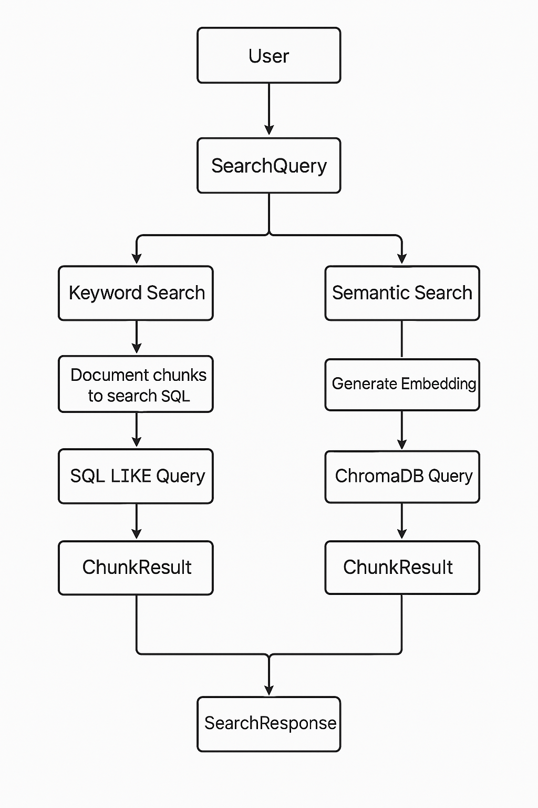

# Step 5: Implement Search Endpoints #

There are two types of search:

1.   **Keyword Search** – basic, fast, just checks if your search words are found in any chunk of text.

2.   **Semantic Search** – smarter, uses AI to understand what you're looking for, even if the exact words don’t match.

You're using FastAPI, Pydantic, SQLAlchemy, and ChromaDB (a vector database for semantic search). 

Let's implement the keyword and semantic search endpoints. We'll add these to the existing document router for now.
   
[Reasoning behind the code](reasoning/r5.md)
   
1.  **No New Dependencies:** We should have all necessary libraries installed already.

2.  **Define Search Request/Response Models (`app/api/endpoints/documents.py`):**
    Add these Pydantic models within `app/api/endpoints/documents.py` to define the structure of our search requests and results.

    ```python
    # app/api/endpoints/documents.py
    # ... (existing imports)
    from typing import List, Optional, Dict, Any # Ensure Dict and Any are imported
    from pydantic import BaseModel, Field
    import sqlalchemy # Import sqlalchemy for query building

    # ... (existing code: UploadResponse, DocumentStatus) ...

    # --- NEW: Search Models ---

    class SearchQuery(BaseModel):
        query: str = Field(..., description="The search query text.")
        top_k: int = Field(default=5, ge=1, le=100, description="Number of top results to return.")
        # Optional filter by document ID(s)
        document_ids: Optional[List[str]] = Field(default=None, description="Optional list of document IDs to search within.")

    class ChunkResult(BaseModel):
        document_id: str
        chunk_id: str
        chunk_index: int
        text_content: str
        # For semantic search, include similarity score (distance)
        score: Optional[float] = None
        # Include other relevant metadata from the chunk or document
        metadata: Optional[Dict[str, Any]] = None # Store Chroma metadata or other info

    class SearchResponse(BaseModel):
        results: List[ChunkResult]
        query: str
        search_type: str # 'keyword' or 'semantic'


    # ... (rest of the file: router definition, upload endpoint, etc.) ...
    ```
    *   `SearchQuery`: Defines the input, requiring a `query` string and allowing `top_k` results and optional filtering by `document_ids`.
    *   `ChunkResult`: Represents a single result item, including IDs, text, and an optional `score` (useful for semantic search distance/similarity). Added a generic `metadata` field.
    *   `SearchResponse`: Wraps the list of results and includes the original query and type of search performed.

3.  **Add Search Endpoints to Router (`app/api/endpoints/documents.py`):**
    Add the following two endpoint functions within the `documents.py` file, using the `router` instance defined earlier.

    ```python
    # app/api/endpoints/documents.py
    # ... (existing code and new models) ...

    # --- Dependency for ChromaDB client (optional but good practice) ---
    # If we start using dependencies more, this pattern is cleaner
    # from db.database import get_chroma_client
    # def get_chroma(): return get_chroma_client()
    # Then use: chroma_client: chromadb.ClientAPI = Depends(get_chroma)

    # --- NEW: Keyword Search Endpoint ---
    @router.post(
        "/search/keyword",
        response_model=SearchResponse,
        summary="Perform keyword search on document chunks",
        description="Searches the text content of document chunks using SQL LIKE queries.",
    )
    async def keyword_search(
        search_request: SearchQuery,
        # db: databases.Database = Depends(get_sqlite_db) # Inject if needed, or use global 'database'
    ):
        """
        Performs a case-insensitive keyword search on the 'text_content' field
        of the document chunks stored in SQLite.
        """
        logger.info(f"Keyword search request received: query='{search_request.query}', top_k={search_request.top_k}")

        # Build the base query
        query = document_chunks_table.select().where(
            # Case-insensitive LIKE search
            document_chunks_table.c.text_content.ilike(f"%{search_request.query}%")
        )

        # Apply document ID filter if provided
        if search_request.document_ids:
            query = query.where(document_chunks_table.c.document_id.in_(search_request.document_ids))

        # Add limit
        query = query.limit(search_request.top_k)
        # Optional: Add ordering, e.g., by chunk index or document ID
        query = query.order_by(document_chunks_table.c.document_id, document_chunks_table.c.chunk_index)


        try:
            results = await database.fetch_all(query) # Use global 'database' instance
            logger.info(f"Keyword search found {len(results)} results for query '{search_request.query}'.")

            # Format results
            chunk_results = [
                ChunkResult(
                    document_id=row["document_id"],
                    chunk_id=row["id"],
                    chunk_index=row["chunk_index"],
                    text_content=row["text_content"],
                    score=None, # No score for keyword search
                    metadata=row["metadata"] # Pass along any metadata stored in the chunk row
                )
                for row in results
            ]

            return SearchResponse(
                results=chunk_results,
                query=search_request.query,
                search_type="keyword"
            )

        except Exception as e:
            logger.error(f"Error during keyword search for query '{search_request.query}': {e}", exc_info=True)
            raise HTTPException(status_code=500, detail=f"Keyword search failed: {e}")


    # --- NEW: Semantic Search Endpoint ---
    @router.post(
        "/search/semantic",
        response_model=SearchResponse,
        summary="Perform semantic search using vector embeddings",
        description="Generates embedding for the query and searches ChromaDB for similar document chunks.",
    )
    async def semantic_search(
        search_request: SearchQuery,
        # db: databases.Database = Depends(get_sqlite_db) # Not needed here directly
        # chroma_client: chromadb.ClientAPI = Depends(get_chroma) # Use dependency injection if preferred
    ):
        """
        Performs semantic search using embeddings stored in ChromaDB.
        """
        logger.info(f"Semantic search request received: query='{search_request.query}', top_k={search_request.top_k}")

        chroma_client = get_chroma_client() # Get client directly
        try:
            doc_collection = chroma_client.get_collection(settings.DOCUMENT_COLLECTION_NAME)
        except Exception as e:
             logger.error(f"Could not get ChromaDB collection '{settings.DOCUMENT_COLLECTION_NAME}': {e}")
             raise HTTPException(status_code=500, detail="Could not connect to vector database collection.")

        # 1. Generate embedding for the query
        # Again, note this is blocking. Use run_in_executor for production.
        try:
            logger.info(f"Generating embedding for query: '{search_request.query}'")
            query_embedding = generate_embeddings([search_request.query]) # Pass query as a list
            if not query_embedding or not query_embedding[0]:
                raise ValueError("Failed to generate query embedding.")
            logger.info("Query embedding generated successfully.")
        except Exception as e:
            logger.error(f"Failed to generate embedding for query '{search_request.query}': {e}", exc_info=True)
            raise HTTPException(status_code=500, detail=f"Failed to generate query embedding: {e}")

        # 2. Build ChromaDB query filter (if document_ids are provided)
        chroma_where_filter = None
        if search_request.document_ids:
            if len(search_request.document_ids) == 1:
                 chroma_where_filter = {"document_id": search_request.document_ids[0]}
            else:
                 chroma_where_filter = {
                     "$or": [{"document_id": doc_id} for doc_id in search_request.document_ids]
                 }
            logger.info(f"Applying ChromaDB where filter: {chroma_where_filter}")


        # 3. Query ChromaDB
        try:
            logger.info(f"Querying ChromaDB collection '{doc_collection.name}'...")
            results = doc_collection.query(
                query_embeddings=query_embedding, # Pass the generated embedding (inside a list)
                n_results=search_request.top_k,
                # Specify what data to include in the results
                include=['metadatas', 'documents', 'distances'],
                where=chroma_where_filter # Apply the filter if created
            )
            logger.info(f"ChromaDB query returned {len(results.get('ids', [[]])[0])} results.") # Chroma returns results nested in lists

        except Exception as e:
            logger.error(f"Error querying ChromaDB for query '{search_request.query}': {e}", exc_info=True)
            raise HTTPException(status_code=500, detail=f"Vector database query failed: {e}")

        # 4. Process and format ChromaDB results
        chunk_results = []
        # Results are returned as lists of lists (one inner list per query, we only have one query)
        ids = results.get('ids', [[]])[0]
        distances = results.get('distances', [[]])[0]
        metadatas = results.get('metadatas', [[]])[0]
        documents = results.get('documents', [[]])[0]

        for i, chunk_id in enumerate(ids):
            metadata = metadatas[i] if metadatas and i < len(metadatas) else {}
            # Construct the ChunkResult
            chunk_results.append(
                ChunkResult(
                    # Extract info primarily from metadata if stored there during ingestion
                    document_id=metadata.get("document_id", "Unknown"),
                    chunk_id=chunk_id,
                    chunk_index=metadata.get("chunk_index", -1), # Get index from metadata
                    text_content=documents[i] if documents and i < len(documents) else "",
                    score=distances[i] if distances and i < len(distances) else None, # Lower distance = more similar
                    metadata=metadata # Pass along the full metadata dict
                )
            )

        return SearchResponse(
            results=chunk_results,
            query=search_request.query,
            search_type="semantic"
        )


    # ... (existing endpoints: /status/{document_id}, GET /) ...
    ```
    *   **Keyword Search:**
        *   Uses SQLAlchemy Core's `select()` and `where()` with `ilike()` for case-insensitive partial matching.
        *   Applies `document_id` filtering if requested.
        *   Limits results using `top_k`.
        *   Fetches results from SQLite using `database.fetch_all()`.
        *   Maps the database rows to the `ChunkResult` model.
    *   **Semantic Search:**
        *   Gets the ChromaDB client and collection.
        *   Generates the query embedding using `generate_embeddings`. (Reminder: This is blocking in the current implementation).
        *   Constructs a `where` filter dictionary for ChromaDB if `document_ids` are provided. ChromaDB uses a specific syntax (`$or` for multiple items).
        *   Calls `doc_collection.query()` passing the `query_embeddings`, `n_results`, `include` list, and optional `where` filter.
        *   Parses the somewhat complex structure returned by `chromadb.query()` (lists within lists).
        *   Maps the ChromaDB results (IDs, distances, metadata, documents) to our `ChunkResult` model. Note that `distances` are returned by Chroma; lower values mean higher similarity for metrics like cosine or L2. We assign this to the `score` field.

4.  **Run and Test:**
    *   Restart the server: `uvicorn app.main:app --reload --reload-dirs app --reload-dirs core --reload-dirs db --reload-dirs services`
    *   Make sure you have uploaded and processed at least one document successfully (status `completed`).
    *   Go to the API docs (`http://localhost:8000/docs`).
    *   Expand the "Documents" section. You should now see the two new POST endpoints: `/api/v1/documents/search/keyword` and `/api/v1/documents/search/semantic`.
    *   **Test Keyword Search:**
        *   Use `/search/keyword`. Click "Try it out".
        *   Enter a query term you know exists in your test document(s) in the `query` field of the request body.
        *   Optionally adjust `top_k`.
        *   Optionally add a valid `document_id` in the `document_ids` list `["your-doc-id"]`.
        *   Execute. Verify the results contain the keyword and match filters.
    *   **Test Semantic Search:**
        *   Use `/search/semantic`. Click "Try it out".
        *   Enter a query phrase related to the content of your test document(s) (it doesn't need exact keywords).
        *   Optionally adjust `top_k` and add `document_ids`.
        *   Execute. Examine the results. They should be semantically related chunks, ordered by similarity (lower `score`/distance is better). Compare the `text_content` of the results to your query.

**Summary:**

We have now added core search capabilities:
*   API endpoints for both keyword and semantic search.
*   Keyword search implemented using SQL `LIKE` against the chunk text in SQLite.
*   Semantic search implemented by embedding the query and using ChromaDB's vector search.
*   Support for filtering search results by specific document IDs in both search types.
*   Structured request and response models for search operations.

---



---

| **Concept**            | **What It Does**                                              |
|------------------------|---------------------------------------------------------------|
| `SearchQuery`          | Defines what the user sends when searching                    |
| `ChunkResult`          | Represents one chunk of matched text                          |
| `SearchResponse`       | Wraps up all the results and sends them back                  |
| Keyword Search         | Uses SQL to find exact matches of your text                   |
| Semantic Search        | Uses embeddings + ChromaDB to find similar meanings           |
| ChromaDB               | A database that works with vectors, not just text             |
| Embeddings             | Turn words into numbers so computers can understand meaning   |

---

**Important Considerations:**

*   **Blocking Embedding:** The semantic search endpoint currently blocks the server's event loop while generating the query embedding. For production use with concurrent users, this should be addressed using `asyncio.to_thread` (Python 3.9+), `loop.run_in_executor`, or a background task queue.
*   **Keyword Search Performance:** For very large numbers of chunks, simple `LIKE` queries might become slow. SQLite's Full-Text Search (FTS5) extension is a much more performant option for keyword searching if needed.
*   **Hybrid Search:** Advanced RAG often uses "hybrid search," combining results from both keyword and semantic search using techniques like Reciprocal Rank Fusion (RRF) to get the best of both worlds. This is a potential future enhancement.

**Next Steps:**

With document ingestion and search in place, the next major component is managing **Chat Sessions**:

1.  Create API endpoints to:
    *   Start a new chat session (potentially linking initial RAG documents).
    *   List existing chat sessions (with filtering/searching based on names, dates, metadata tags).
    *   Get the history of a specific chat session.
    *   Send a new message (prompt) to a session. This endpoint will likely:
        *   Store the user prompt in the `chat_messages` table.
        *   Perform RAG (semantic search) using the prompt and/or session history to find relevant document chunks or past conversation snippets.
        *   Construct a final prompt for the LLM (including context from RAG).
        *   **(Placeholder for LLM interaction)** - Initially, we might just return the constructed prompt or dummy response.
        *   Store the LLM's response in `chat_messages`.
    *   Delete a session.
2.  Implement logic to store session metadata (ID, name, timestamps, model used, RAG docs) in the `sessions` table.
3.  Implement logic to store individual prompts/responses in the `chat_messages` table, linked to a session.
4.  **(Later)** Integrate actual LLM calls.
5.  **(Later)** Implement embedding of chat history for long-term recall within a session.
6.  **(Later)** Implement automatic meta-tagging for sessions.
