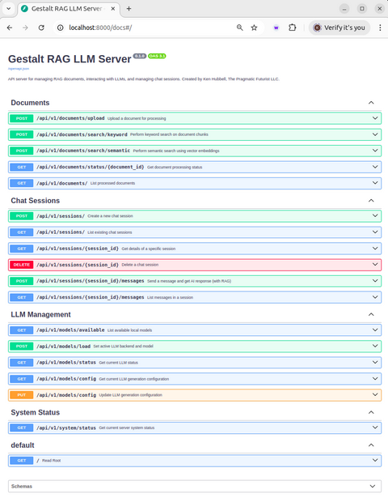

# A Step-by-Step Guide to Build Your Own RAG LLM Server #  

> ### One Prompt Shall Rule Them All ###
> You are an expert Python developer and Large Language Model server designer. I want to work with you to create a RAG LLM server one step at a time and learn along the way about how you are coding it. I want this server to provide an API for uploading, chunking, vector embedding, managing, and providing keyword and semantic search tools for RAG documents using sqlite and chromadb. The documents and text must be accessible by document IDs to avoid the need to send large text packets with prompts during chat sessions. For document processing use beautiful soup, python-dox, and docling. The server needs to be able to conduct threaded chat sessions and store the prompt and response exchange as RAG and vector embedding for long term search and recall during a session. Sessions must be stored with IDs, date and time information for the last prompt response, the LLM model used, the RAG document IDs if any, and a name for the session. Automatic meta-tagging of the session is applied for searching the list of stored sessions. The server must provide LLM model loading from the HuggingFace CLI and local models and provide a status for when the model is successfully or unsuccessfully loaded. It must provide a list of available local models. The server must provide a means of modifying the settings for the loaded LLM and confirmation when the settings are in place. The server must also provide system status of GPU and CPU, operating temperature if available, disk space, and amount of free RAM plus any other relevant data affecting the operational efficiency of the server. Please start the design and development with the most logical component and we will build each subsequent part of our RAG LLM server after we achieve success with the previous code.
>
> [Click here for the full prompt transcript with bug fixing](instructions/z4_the_complete_prompt_response_thread.md)

***

*Here's a breakdown of the thought process behind generating the initial project structure and `main.py` for the RAG LLM server:*

1.  **Deconstruct the Request:**

    *   **Core Goal:** Build a RAG LLM server, step-by-step.
    *   **Functionality:**
        *   Document Management: Upload, chunk, embed, manage (CRUD?). Store in SQLite/ChromaDB. Accessible by ID.
        *   Document Processing: Use BeautifulSoup (HTML/XML), python-docx (DOCX), `docling` (needs clarification, assumed generic text processing/chunking for now).
        *   Search: Keyword and Semantic search over documents.
        *   Chat Sessions: Threaded, store prompt/response pairs, RAG/embed these exchanges, session management (ID, timestamp, model, RAG docs, name, auto meta-tags).
        *   LLM Management: Load from HuggingFace CLI/local, status, list local models, modify settings, confirmation.
        *   System Monitoring: CPU/GPU status, temp, disk, RAM.
        *   API: Expose all functionality via an API.
    *   **Technology Stack:**
        *   Python
        *   API Framework: FastAPI (good choice for async, modern Python APIs)
        *   Databases: SQLite (metadata, sessions), ChromaDB (vector embeddings)
        *   Document Processing: BeautifulSoup, python-docx, `docling` (placeholder)
        *   LLM Interaction: Hugging Face libraries (`transformers`, maybe `accelerate`)
        *   System Monitoring: `psutil`, potentially GPU-specific libraries (like `pynvml` for NVIDIA).
    *   **Development Process:** Step-by-step, explain the code. Start with the most logical component.

2.  **Identify the "Most Logical Starting Component":**

    *   What's the foundation? The server itself. We need a way to run the code and expose endpoints. An API framework is the natural starting point.
    *   Within the API, what's the *most* fundamental piece? Just getting the server *running* and maybe a basic health check endpoint. This ensures the core infrastructure is in place before adding complex logic.
    *   Alternative starting points considered:
        *   *Document Processing:* Could start here, but without an API or database, it's just standalone scripts. Less integrated.
        *   *LLM Loading:* Complex, depends on external libraries and potentially hardware. Better to establish the server structure first.
        *   *Database Setup:* Important, but needs the API context to be truly useful.
    *   Conclusion: Start with the basic FastAPI application structure and a simple root or health endpoint.

3.  **Design the Project Structure:**

    *   A well-organized project is crucial for maintainability, especially as complexity grows.
    *   **`main.py`:** The entry point for the FastAPI application. Keeps the top level clean.
    *   **`app/` directory:** Contains the core application logic, separated by concern.
        *   **`api/`:** Holds the API endpoint definitions (routers). This promotes modularity. We'll have routers for documents, sessions, models, system status, etc.
        *   **`core/`:** Configuration, settings, maybe startup/shutdown events.
        *   **`services/`:** Business logic layer. Document processing, embedding, chat handling, LLM interaction, system monitoring logic will live here. Separates logic from API definitions.
        *   **`models/`:** Pydantic models for API request/response validation and data structures (e.g., Document, Session, ChatMessage). Also potentially database models if using an ORM later (though SQLite might be simple enough without one initially).
        *   **`db/`:** Database interaction logic. Functions to interact with SQLite and ChromaDB.
        *   **`utils/`:** Helper functions, common utilities (e.g., ID generation, logging setup).
    *   **`data/`:** Placeholder for persistent data (SQLite DB, ChromaDB files, potentially uploaded docs if not stored elsewhere). Should be in `.gitignore`.
    *   **`models_local/`:** Placeholder for locally downloaded LLM files. Should be in `.gitignore`.
    *   **`requirements.txt`:** Lists project dependencies. Essential for reproducibility.
    *   **`.env` (optional but recommended):** For environment variables (API keys, database paths, etc.). Should be in `.gitignore`.
    *   **`.gitignore`:** Standard practice to exclude unnecessary files/directories from version control.

4.  **Implement the First Step (Basic Server Setup):**

    *   **`requirements.txt`:** Start with the absolute minimum: `fastapi` and `uvicorn` (the ASGI server to run FastAPI).
    *   **`main.py`:**
        *   Import `FastAPI`.
        *   Create a `FastAPI` app instance (`app = FastAPI(...)`). Add a title and description for good measure (helps with docs).
        *   Define a simple root endpoint (`@app.get("/")`) that returns a welcome message. This serves as a basic health check and confirms the server is running.
    *   **Running the Server:** Explain the `uvicorn main:app --reload` command. `--reload` is crucial during development.

5.  **Explain the Code and Next Steps:**

    *   Clearly explain *why* this structure was chosen (modularity, maintainability).
    *   Explain the purpose of `main.py`, `FastAPI`, `@app.get("/")`, and `uvicorn`.
    *   Explicitly state the next logical step: Setting up configuration management and potentially the database connections, as these are foundational elements needed by many other components. This sets expectations for the next interaction.

6.  **Refinement during Thought Process:**

    *   Initial thought: Maybe put *all* API endpoints in `main.py`? No, that gets messy quickly. Routers are better (`app/api/`).
    *   Should database logic be in `services/`? No, better to have a dedicated `db/` layer for separation of concerns. Services *use* the DB layer.
    *   What about `docling`? It's not a standard library. Acknowledge this and treat it as a placeholder for now, focusing on the *concept* of document processing. We can integrate specific libraries later.
    *   How to handle threading for chat sessions? FastAPI is async, which handles I/O-bound concurrency well. CPU-bound tasks (like LLM inference) might need `run_in_threadpool` or separate worker processes later, but don't overcomplicate the initial setup. Acknowledge threading is needed *later*.
    *   Error handling? Add basic exception handlers later. Focus on the core structure first.

This structured approach ensures that the foundation is solid before adding more complex features.  

  

  

***

**[Setup 1: CUDA Environment Setup](instructions/setup_1_cuda_environment_setup_guide.md)**

**[Setup 2: Required Python Package Installation](instructions/setup_2_python_required_packages_installation.md)**

***

**[Step 0: Server Architecture Overview](instructions/rag_llm_server_architecture.md)**

*   **What:** A high level overview of the architecture and data flow.
*   **Why:** As we build out the system and its components, it is important to understand how all of the pieces work together.
    
**[Step 1: Basic Server Structure (FastAPI)](instructions/step_01_basic_server_structure.md)**

*   **What:** Set up a minimal FastAPI application (`app/main.py`) run by Uvicorn. Created a root endpoint (`/`).
*   **Why:** To establish the core web server framework using a modern, high-performance, async-capable library. Provides basic API structure and automatic documentation (`/docs`).

**[Step 2: Configuration & Database Initialization](instructions/step_02_configuration_and_database_init.md)**

*   **What:** Defined settings using Pydantic (`core/config.py`), set up SQLite table schemas using SQLAlchemy Core (`db/models.py`), initialized ChromaDB client, and managed database connections (`db/database.py`). Created data directories.
*   **Why:** Centralize configuration; define persistent storage for metadata (SQLite) and vectors (ChromaDB); ensure database connections are handled correctly during server startup/shutdown.

**[Step 3: Document Upload and Background Processing](instructions/step_03_document_upload_and_processing.md)**

*   **What:** Created API endpoints for file upload (`app/api/endpoints/documents.py`). Implemented file handling, text extraction (`services/document_processor.py` using `python-docx`, `pypdf`, `beautifulsoup4`), chunking (`langchain-text-splitters`), and initial SQLite record creation. Used FastAPI `BackgroundTasks` for processing.
*   **Why:** To allow users to ingest documents; handle different file types; break large documents into manageable chunks; offload time-consuming processing from the initial API request for better responsiveness.

**[Step 4: Vector Embedding Integration](instructions/step_04_vector_embedding.md)**

*   **What:** Integrated `sentence-transformers` (`services/embedding_service.py`) to load an embedding model (pre-loaded on startup). Modified the background task to generate embeddings for chunks and store them, along with text and metadata, in ChromaDB. Updated document status in SQLite.
*   **Why:** To convert text chunks into numerical representations (vectors) suitable for semantic similarity search, enabling the core RAG functionality.

**[Step 5: Search Endpoints](instructions/step_05_search_endpoints.md)**

*   **What:** Added API endpoints for keyword search (using SQL `LIKE` against SQLite chunks) and semantic search (embedding the query and querying ChromaDB) within `app/api/endpoints/documents.py`.
*   **Why:** To provide tools for retrieving relevant document chunks based on user queries, forming the retrieval part of RAG.

**[Step 6: Chat Session and Message Management API](instructions/step_06_chat_session_and_management.md)**

*   **What:** Created API models (`app/api/models/chat.py`) and endpoints (`app/api/endpoints/sessions.py`) for managing chat sessions (CRUD) and messages (add/list). Stored session metadata and message history in SQLite tables (`sessions`, `chat_messages`).
*   **Why:** To maintain conversation state, link RAG documents to sessions, and store the prompt-response history needed for context and future interaction.

**[Step 7: Integrate RAG and Placeholder LLM Call](instructions/step_07_integrate_rag.md)**

*   **What:** Modified the "add message" endpoint to: fetch associated RAG documents, perform semantic search based on the user query, retrieve chat history, construct a detailed prompt (including context/history), simulate an LLM call, and store both user/assistant messages. Added context truncation logic. Added summarization step.
*   **Why:** To implement the full RAG loop within a chat context, assembling the necessary information before calling the LLM and handling context window limits. The placeholder simulates the final generation step.

**[Step 8: LLM Loading and Management API](instructions/step_08_llm_loading_and_management.md)**

*   **What:** Introduced an abstraction layer (`services/llm_backends.py`) for different LLM backends (local, Ollama, vLLM). Refactored `services/llm_service.py` to manage the active backend. Created API endpoints (`app/api/endpoints/models.py`) to list available models, dynamically load/configure the active backend and model (via API request or config defaults), check status, and update generation parameters. Handled local model loading (including quantization via `bitsandbytes`) in background threads.
*   **Why:** To provide flexibility in choosing the LLM inference source without changing the core chat logic; manage the complex process of loading/unloading local models safely; allow runtime configuration.

**[Step 9: Real LLM Integration & Final Auth/Fixes](instructions/step_10_optional_external_llm_servers.md)**

*   **What:** Replaced the placeholder LLM call with a call to the active backend via `llm_service.generate_text`, ensuring blocking calls run in an executor. Added a startup check (`app/main.py`) for Hugging Face authentication (`huggingface_hub` token via env/`.env` or CLI cache). Debugged various errors related to argument passing, state access, and library interactions.
    *   **Why:** To connect the RAG pipeline to an actual LLM for response generation; ensure prerequisites for gated models are met; resolve runtime errors for a functional system.

**[Step 10: System Status API](instructions/step_09_system_status_api.md)**

*   **What:** Created API endpoints (`app/api/endpoints/system.py`) and a service (`services/system_service.py`) using `psutil` and `pynvml` to report CPU, RAM, Disk, GPU (optional), and Temperature (optional) metrics. Added NVML shutdown to the FastAPI shutdown event.
*   **Why:** To provide visibility into the server's resource usage and operational health, aiding monitoring and debugging.

**[Step 11: (Optional) Validate HuggingFace Login Token for LLM Access ](instructions/step_11_optional_huggingface_token.md)**

*   **What:** Integrated validation of HuggingFace Token from either HuggingFace local cache or .env file (`app/api/endpoints/system.py`). 
*   **Why:** To simplify the process of accessing HuggingFace Hub private models that require token.

**[Step 12: (Optional) Future Features and Enhancements ](instructions/step_12_xtra_credit_future_features.md)**

*   **What:** Once the foundational server is built, try these additional features and enhancements. 
*   **Why:** The server you built is just a starting point for learning all about generative AI and LLMs.

***   

**[Adding Access to Online LLMs like Google Gemini](instructions/x1_adding_access_to_online_llms.md)

***

**[Glossary of Terms](instructions/z1_glossary.md)**

**[Citations and Additional References](instructions/z2_citations_and_references.md)**

**[Environment Setup](instructions/z3_environment_clone_setup_quickstart.md)**  

